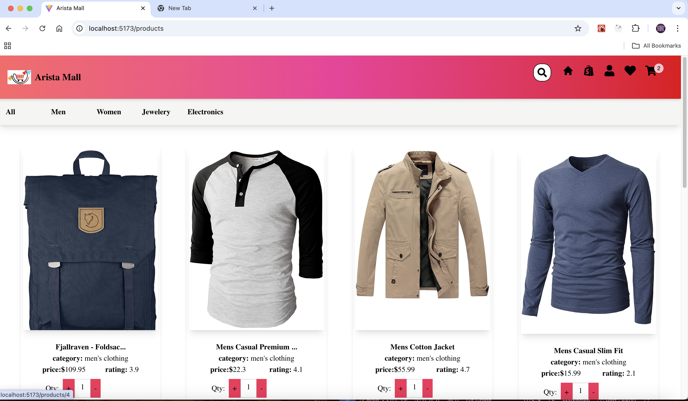
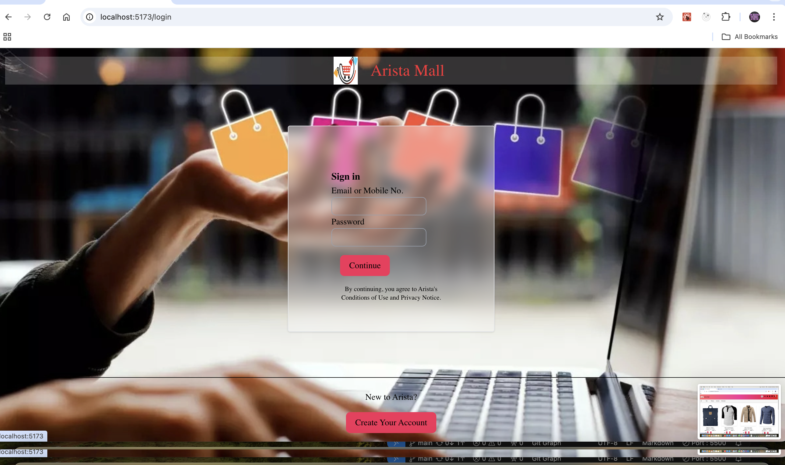
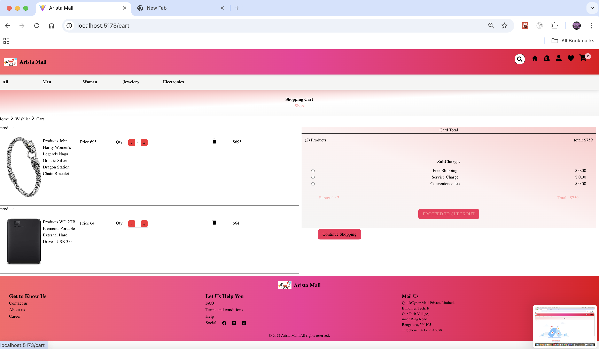
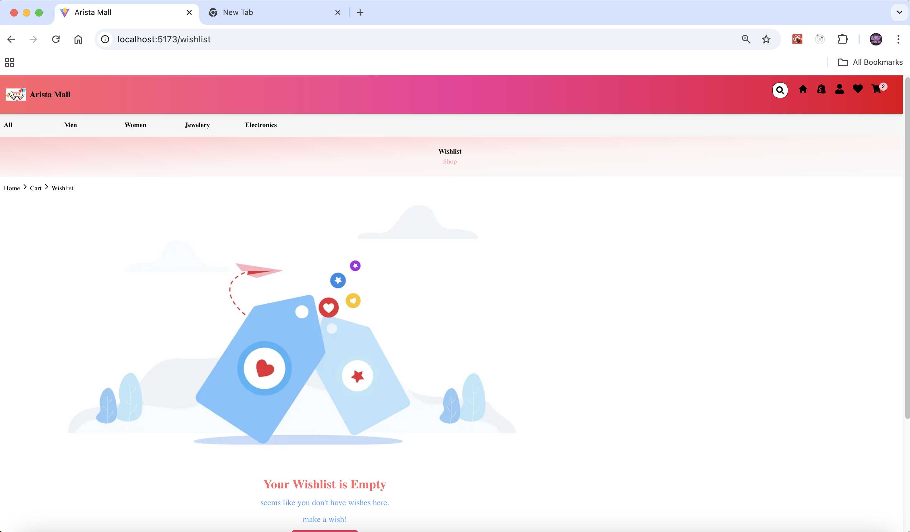

# 🔥 Arista Mall

A sleek, modern React-based powered by vite e-commerce experience with product discovery, cart features, wishlist options login and signup and smooth navigations.


## 🚀 Live Demo

Check out the deployed app here: [Live App](https://aristaamall.netlify.app)


## Screenshots
home page:

shop page:

login page:

cart page:

wishlist page:


 ## 📚 Table of Contents
- [Features](#features)
- [Tech Stack](#tech-stack)
- [Installation](#installation)
- [contributing](#contributing)
- [Running Tests](#running-test)
- [Usage](#usage)

## Features

- 🔍 Product filtering by category
- 🛒 Add to cart
- ❤️ add to wishlist
-  🏬 product display
- 🔍 search of product
- 💁🏻‍♂️ login/ signup 
- 🧩 product details


## Tech Stack

- React, vite
- react-redux
- react router
- react-icons
- react-dom
- react-hot-toast
- customizable-react-badges
- react-hot-toast
- react-loader-spinner
- react-parallax
- react-slick
- tailwind css
- vitest, react library test


## 🧰 Installation

#### Install project with npm

Clone the repo and navigate to project directory:
   ```bash
   git clone https://github.com/karnpriya08/Arista
   cd Arista
```
####  Install dependencies:

```bash
   npm install 
   or 
   npm install --legacy-peer-deps 
```
#### Start the development server:
```bash
  npm run dev
```

## 🤝 Contributing

Contributions are always welcome!

Feel free to fork the project and submit pull requests. For major changes, open an issue first.
## Running Tests

To run tests, run the following command

```bash
  npm run test
```


###  **Usage**
```markdown
## 🧪 Usage

- Visit the homepage to browse fantastic finds project recoomended.
- browse project by categories.
- Add items to your cart and proceed to checkout.
- update the quantity of items in cart.
- add items to your wishlist.
- add items to cart from wishlist.
- provide details of product in product detail page.
- create user using sign up.
- login the site.
- search product by product name.
